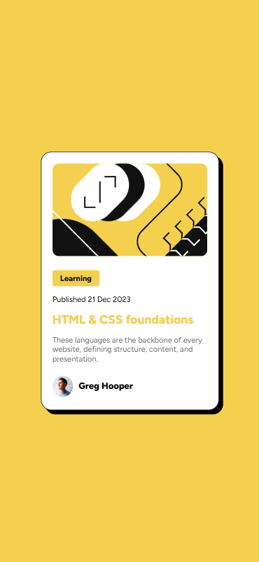

# Frontend Mentor - Blog preview card solution

This is a solution to the [Blog preview card challenge on Frontend Mentor](https://www.frontendmentor.io/challenges/blog-preview-card-ckPaj01IcS). Frontend Mentor challenges help you improve your coding skills by building realistic projects.

## Table of contents

- [Overview](#overview)
  - [The challenge](#the-challenge)
  - [Screenshot](#screenshot)
  - [Links](#links)
- [My process](#my-process)
  - [Built with](#built-with)
  - [What I learned](#what-i-learned)
  - [Continued development](#continued-development)
- [Author](#author)

## Overview

### The challenge

Users should be able to:

- See hover and focus states for all interactive elements on the page

### Screenshot

### Links

- Solution URL: [Solution URL here](https://www.frontendmentor.io/solutions/blog-preview-card-xTEmDKnpfl)
- Live Site URL: [Live site URL here](https://miltondjc.github.io/blog-preview-card-fm/)

## My process

### Built with

- Semantic HTML5 markup
- CSS custom properties
- Flexbox
- Mobile-first workflow

### What I learned

In this section I learned how to manage the size of things using relative measurements like vw and vw. Furthermore, I learned how to import styles for using CSS custom properties.

### Continued development

For future projects I want to keep improving with relative measurements. In addition, I want to use other tools to improve this project.

## Author

- Frontend Mentor - [@MiltonDJC](https://www.frontendmentor.io/profile/MiltonDJC)
- GitHub - [MiltonDJC](https://github.com/MiltonDJC)
- Linkedin - [Milton De Jesus Coria](www.linkedin.com/in/milton-de-jesus-coria-011749234)
